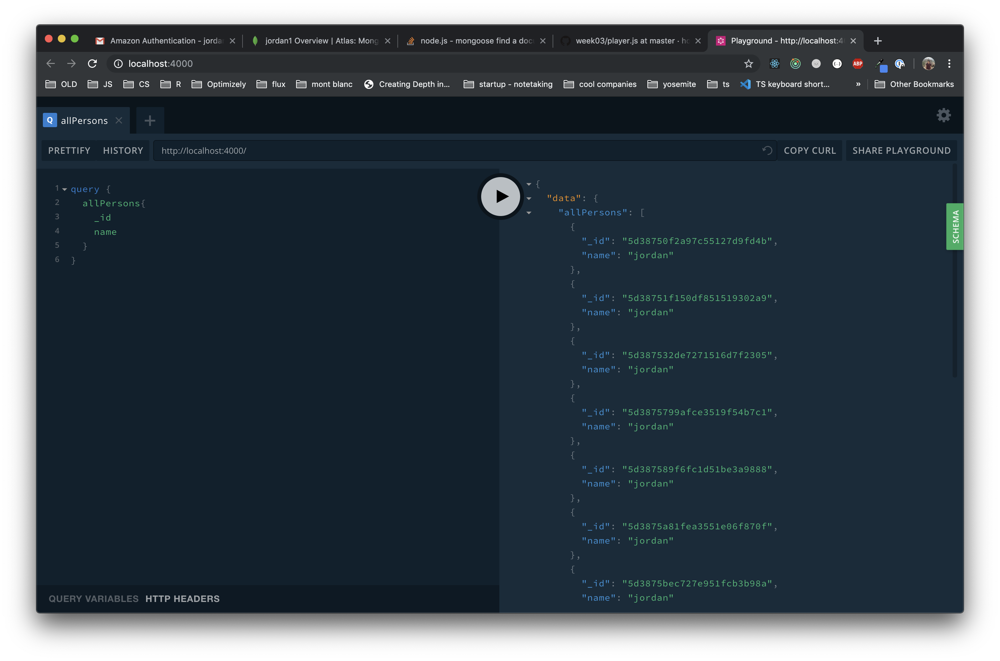

# Apollo Server Setup

In this example we'll be setting up an Apollo server, which will expose a GraphQL endpoint

### Setup

1. `cd server`

2. `npm install`

### Building our GraphQL model

The first step is to define our Schema. This will tell apollo the shape of the data.

Edit the file `src/schema.js`

### Defining our data types

```
type Person {
  _id: ID!
  name: String!
  age: Int!
  posts: [Post!]
}

type Post {
  _id: ID!
  title: String!
  content: String!
  author: Person!
}
```

### Defining the top level Query type

The `type Query` exposing the top level interface to our GraphQL endpoint. Here we define all the ways a client can ask for data

```
type Query {
  allPersons: [Person!]

  Person(id: ID!): Person

  Post(id: ID!): Post
}
```

### Defining Mutations

Mutations are the different ways clients can add, change or remove data in our GraphQL API.

Lets create mutations for `createPerson` and `createPost`

```
type Mutation {
  createPerson(name: String!, age: Int!): Person!

  createPost(author: ID!, title: String!, content: String!): Post!
}
```

<details>
  <summary>Full schema.js file</summary>

```javascript
const { gql } = require("apollo-server");

const typeDefs = gql`
  # GraphQL Schema goes here
  type Person {
    _id: ID!
    name: String!
    age: Int!
    posts: [Post!]
  }

  type Post {
    _id: ID!
    title: String!
    content: String!
    author: Person!
  }

  type Query {
    allPersons: [Person!]

    Person(id: ID!): Person

    Post(id: ID!): Post
  }

  type Mutation {
    createPerson(name: String!, age: Int!): Person!

    createPost(author: ID!, title: String!, content: String!): Post!
  }
`;

module.exports = typeDefs;
```

</details>

### Schema definition completed

Now that the schema is defined, and passed to the ApolloServer in `src/index.js` we can run apollo server.

### Running Apollo Locally

1. `npm start`

Testing if it works: [http://localhost:4000](http://localhost:4000)

You should see a UI that looks like this (but with no data in it yet)



### Hooking GraphQL up to a database

The beauty of GraphQL is that is can be used with many different types of database technologies (even at the same time).  For this example we'll be using MongoDB.

1. Create a `env.sh` file containing:

```sh
export MONGODB_URI='mongodb+srv://jordan:<password@jordan1-xmznx.mongodb.net/graphql?retryWrites=true&w=majority'
```

The project has already created the models for [`Post`](src/models/post.js) and [`Person`](src/models/person.js).


### Creating Resolvers

Resolvers are the server's implementation of how `Query` and `Mutation` operations are executed. So far we've just defined the schema, but haven't told the server how to handle these requests.

The resolvers map a `Query` or `Mutation` to a javascript function that fulfills the request.

Open `src/resolvers.js`


<details>
  <summary>completed resolvers.js file</summary>

```js
const Person = require("./models/person");
const Post = require("./models/post");

module.exports = {
  Query: {
    allPersons: async () => {
      const people = await Person.find();

      return Promise.all(
        people.map(async person => {
          return {
            // cast to an object from mongo db document
            ...person.toObject(),
            posts: await Post.find({ author: person._id })
          };
        })
      );
    },

    Person: async (_, { id }) => {
      const person = await Person.findById(id);
      const posts = await Post.find({ author: person._id });
      return {
        // cast to an object from mongo db document
        ...person.toObject(),
        posts
      };
    },

    Post: async (_, { id }, { dataSources }) => {
      return await Post.findById(id);
    }
  },

  Mutation: {
    createPost: async (_, { title, content, author }) => {
      const post = new Post({ title, content, author });
      return await post.save();
    },

    createPerson: async (_, { name, age }) => {
      const person = new Person({ name, age });
      return await person.save();
    }
  }
};
```
</details>


### Test everything out

open [http://localhost:4000](http://localhost:4000)

**Query all people**

```
query {
  allPersons{
		name
  }
}
```

**Create a person**

```
mutation {
  createPerson(name: "Jordan", age: 30) {
    _id
    name
  }
}
```

**Get the person you just created**

Copy the _id from the previous result and use it in the following query

```
query {
  Person(id: <Previous _id>) {
    name
    age
    posts {
      _id
      title
      content
    }
  }
}
```

**Create an post with that person**

```
mutation {
  createPost(title: "Post title", content: "Post content", author: <Previous _id>) {
    _id
    title
    content
  }
}
```


### Congratulations

You've made it through the first part of GraphQL + Apollo.  Next up we'll be implementing the client side part.
